# Architecture Diagram

## Confirmed Target Architecture Update

The diagram below was created before the confirmed terminology update. In the
production target:

```text
app       = client application consuming the GMS
connector = GitHub MCP, SharePoint, Outlook, or another external integration
```

The target GMS acts as a full proxy:

```text
Client app request
-> authenticate app ID and API key
-> load global and app-specific rules
-> input rail
-> GMS agent and selected main LLM
-> tool guard
-> connector tool execution
-> output rail
-> response returned to client app
```

One app can use multiple connectors. One user can manage multiple apps, and one
app can be managed by multiple users. Main-agent and guardrail-classification
LLMs can use separate configurations.

See `docs/target-architecture.md` for the authoritative target tables and
runtime flow. The large diagram below remains useful conceptually, but labels
such as "App Adapter" should now be read as "Connector Adapter".

```mermaid
flowchart TB

%% =========================
%% ADMIN MANAGEMENT PLATFORM
%% =========================

subgraph AdminLayer["Admin / Guardrails Management Platform"]
    A1["Admin User"]
    A2["Next.js 13 Frontend<br/>Admin Dashboard"]
    A3["Drag-and-Drop Policy Builder<br/>Lego-style Blocks"]
    A4["Policy Template Library"]
    A5["Policy Testing Console"]
    A6["Policy Activation / Deactivation Panel"]
    A7["Audit Log Viewer"]

    A1 --> A2
    A2 --> A3
    A2 --> A4
    A2 --> A5
    A2 --> A6
    A2 --> A7
end


%% =========================
%% BACKEND API
%% =========================

subgraph BackendLayer["Backend System"]
    B1["Python FastAPI Backend"]
    B2["Policy CRUD Service"]
    B3["Policy Validation Service<br/>Pydantic"]
    B4["Policy Compiler"]
    B5["App Adapter Registry"]
    B6["Deployment Service"]
    B7["Runtime Policy Loader"]
    B8["Audit / Logging Service"]

    B1 --> B2
    B1 --> B3
    B1 --> B4
    B1 --> B5
    B1 --> B6
    B1 --> B7
    B1 --> B8
end


%% =========================
%% DATABASE
%% =========================

subgraph DatabaseLayer["PostgreSQL Database"]
    C1[("Apps Table<br/>GitHub, Outlook, Slack, Jira")]
    C2[("Agents Table")]
    C3[("Policy Templates")]
    C4[("Policy Versions")]
    C5[("Active Policy Mappings")]
    C6[("Synonym / Phrase Mappings")]
    C7[("Tool Mappings")]
    C8[("Test Cases")]
    C9[("Compiled Guardrail Artifacts")]
    C10[("Audit Logs")]
end


%% =========================
%% POLICY BUILDER LOGIC
%% =========================

subgraph PolicyBuilderFlow["Policy Creation and Compilation Flow"]
    D1["Visual Blocks<br/>Example:<br/>Create + GitHub Repo + Block"]
    D2["Structured Policy DSL<br/>JSON Policy Object"]
    D3["Phrase / Synonym Expansion<br/>create, make, set up<br/>repo, repository"]
    D4["Tool-Level Mapping<br/>github.create_repository"]
    D5["Generated NeMo Guardrails Files"]
    D6["config.yml"]
    D7["rails.co"]
    D8["actions.py"]
    D9["config.py"]

    D1 --> D2
    D2 --> D3
    D2 --> D4
    D2 --> D5
    D5 --> D6
    D5 --> D7
    D5 --> D8
    D5 --> D9
end


%% =========================
%% APP ADAPTERS
%% =========================

subgraph AppAdapters["App Adapter Registry"]
    E1["GitHub Adapter<br/>repo, issue, PR, branch"]
    E2["Outlook Adapter<br/>email, attachment, calendar"]
    E3["Slack Adapter<br/>message, channel, user"]
    E4["Jira Adapter<br/>ticket, project, comment"]

    E5["Generic Policy Blocks"]
    E5 --> E1
    E5 --> E2
    E5 --> E3
    E5 --> E4
end


%% =========================
%% RUNTIME GUARDRAILS
%% =========================

subgraph RuntimeLayer["Runtime Guardrails Enforcement Layer"]
    F1["End User"]
    F2["App Agent UI<br/>GitHub Agent / Outlook Agent / Other"]
    F3["Agent Backend"]
    F4["NeMo Guardrails Runtime"]
    F5["System-Defined Policies<br/>Uniform across all apps"]
    F6["App-Specific Active Policies<br/>Loaded from Postgres"]
    F7["Input Rails<br/>Check user prompt"]
    F8["Dialog / Flow Rails<br/>Control conversation path"]
    F9["Tool-Call Rails<br/>Check proposed tool execution"]
    F10["Output Rails<br/>Check final response"]
    F11["Main LLM<br/>Organisation model / OpenAI-compatible model / NIM"]

    F1 --> F2
    F2 --> F3
    F3 --> F4
    F4 --> F5
    F4 --> F6
    F4 --> F7
    F4 --> F8
    F4 --> F9
    F4 --> F10
    F4 --> F11
end


%% =========================
%% TOOL / MCP LAYER
%% =========================

subgraph ToolLayer["MCP / External Tool Layer"]
    G1["MCP Tool Router"]
    G2["GitHub MCP Server"]
    G3["Outlook / Microsoft Graph API"]
    G4["Slack API"]
    G5["Jira API"]

    G6["External Application Systems"]
    G7["GitHub"]
    G8["Outlook"]
    G9["Slack"]
    G10["Jira"]

    G1 --> G2 --> G7
    G1 --> G3 --> G8
    G1 --> G4 --> G9
    G1 --> G5 --> G10
    G7 --> G6
    G8 --> G6
    G9 --> G6
    G10 --> G6
end


%% =========================
%% OBSERVABILITY
%% =========================

subgraph ObservabilityLayer["Monitoring / Audit / Review"]
    H1["Blocked Prompt Logs"]
    H2["Blocked Tool Call Logs"]
    H3["Policy Trigger History"]
    H4["Admin Change History"]
    H5["Policy Version Rollback"]
    H6["Analytics Dashboard"]

    H1 --> H6
    H2 --> H6
    H3 --> H6
    H4 --> H6
    H5 --> H6
end


%% =========================
%% CONNECTIONS BETWEEN LAYERS
%% =========================

A3 --> D1
A4 --> B1
A5 --> B1
A6 --> B1
A7 --> B1

B2 --> C3
B2 --> C4
B2 --> C5
B3 --> D2
B4 --> D2
B5 --> E5
B6 --> C9
B7 --> C5
B8 --> C10

D2 --> C3
D2 --> C4
D3 --> C6
D4 --> C7
D5 --> C9

E1 --> C7
E2 --> C7
E3 --> C7
E4 --> C7

C5 --> F6
C9 --> F6
B7 --> F6

F4 --> G1
G1 --> F4

F7 --> H1
F9 --> H2
F4 --> H3
B8 --> H4
C4 --> H5
H6 --> A7


%% =========================
%% EXAMPLE POLICY FLOW
%% =========================

subgraph ExampleFlow["Example Policy Flow"]
    X1["Admin creates policy:<br/>Block Create GitHub Repo"]
    X2["Frontend sends policy blocks"]
    X3["Backend validates policy"]
    X4["Policy saved in Postgres"]
    X5["Policy compiler generates NeMo files"]
    X6["Policy activated for GitHub Agent"]
    X7["User asks agent:<br/>Set up a new GitHub repo"]
    X8["Guardrails checks intent and tool call"]
    X9["github.create_repository is blocked"]
    X10["Safe refusal returned to user"]

    X1 --> X2 --> X3 --> X4 --> X5 --> X6 --> X7 --> X8 --> X9 --> X10
end
```



## Current Prototype Overlay - 2026-06-16

The full architecture above is still the target direction. The current research prototype is a smaller GitHub-only slice.

Current implemented path:

```text
User prompt
-> deterministic Python pre-check report only
-> compiled_policy_rules injected into config/prompts.yml template
-> NeMo self_check_input using injected AzureChatOpenAI
-> LangChain agent
-> src/nemo_mcp_guardrails/tool_guard.py MCP tool wrapper
-> blocked tool names compiled from enabled Postgres input policies
-> GitHub MCP server in Docker with GITHUB_READ_ONLY=1
-> NeMo self_check_output using injected AzureChatOpenAI
-> final answer
```

Current policy/compiler/database prototype:

```text
Admin-style policy row
-> Postgres policies table
-> FastAPI CRUD endpoints
-> POST /policies/compile-preview
-> POST /policies/compile-rules stores compiled_policy_rules
-> src/nemo_mcp_guardrails/database/policy_loader.py
-> src/nemo_mcp_guardrails/policy_compiler.py
-> generated NeMo self-check rule preview
-> generated DB-derived tool denylist
-> generated test prompts consumed by scripts/test_nemo_mcp.py
-> prompt_rule_compiler.py injects stored compiled rules into NeMo prompts
```

Current management API slice:

```text
/apps
-> create/manage GMS client apps with hashed API keys

/apps/{app_id}/policy-assignments
-> assign reusable policies to one app

/global-policy-assignments
-> manage mandatory global policy assignments

GET /v1/guardrails/auth-check
-> authenticate X-App-ID + X-API-Key before runtime work

POST /v1/guardrails/run
-> authenticate client app
-> load stored conversation history or bootstrap supplied history
-> trim older turns by NEMO_MAX_RUNTIME_CONTEXT_CHARS
-> build app-scoped policies, compiled prompt rules, blocked tools, rails, and tools
-> execute trimmed history + submitted message through guarded runtime
-> store latest user/assistant turn when conversation_id exists
```

Current reusable execution slice:

```text
src/nemo_mcp_guardrails/guarded_execution.py
-> execute_guarded_message()
-> NeMo input rail
-> stop before action execution when blocked
-> otherwise run LangChain agent with guarded MCP tools
-> NeMo output rail
-> GuardedExecutionResult

scripts/test_nemo_mcp.py
-> choose test prompts and print GuardedExecutionResult
```

Latest verified enabled input policy sample:

```text
github create issue block -> issue_write
github create pull_request block -> create_pull_request
github merge pull_request block -> merge_pull_request
github update file block -> create_or_update_file
```

Current compiler metadata:

- action synonyms: `create`, `open`, `file`, `submit`, `raise`, `log`
- resource synonyms: `issue`, `bug report`
- write tool mapping example: `create + issue -> issue_write`
- read metadata mapping example: `search + repository -> search_repositories`
- generated blocked test prompts for issue creation variants

Completed near-term architecture step:

```text
Postgres enabled input policies
-> policy_loader.py
-> policy_compiler.py generated blocked tool names
-> src/nemo_mcp_guardrails/tool_guard.py runtime denylist
```

Current normalized metadata step:

```text
scripts/seed_normalized_policy_metadata.py
-> connectors: global, github
-> connector_actions
-> connector_resources
-> connector_tool_mappings
-> allowed_test_case_expected_tools
```

Longer-term target:

```text
Postgres policy/template/tool/synonym tables
-> backend compiler
-> generated NeMo prompt/config artifacts
-> runtime input/tool/argument/workflow guard rules
-> generated tests
```

Next implementation direction:

```text
authenticated POST /v1/guardrails/run execution already exists
-> runtime_factory.py builds Azure, NeMo rails, read-only guarded MCP tools, and agent objects
-> execute_guarded_message() runs the submitted message
-> return final structured execution JSON
-> keep normal GitHub MCP tests read-only
-> later OpenShift deployment
```

Future write-capable behavior should not rely only on prompt rails or a tool-name denylist. Use cases like allowing PR merges only in sequence `A -> B -> C` need tool arguments and workflow state, for example current merge history and the next allowed step.

Important current decision:

- No custom `config/policies.yml` is being used yet.
- `policies.yml` is not a standard NeMo Guardrails file.
- The future database-backed policy store should replace the current in-Python prototype when the backend/admin system is built.
